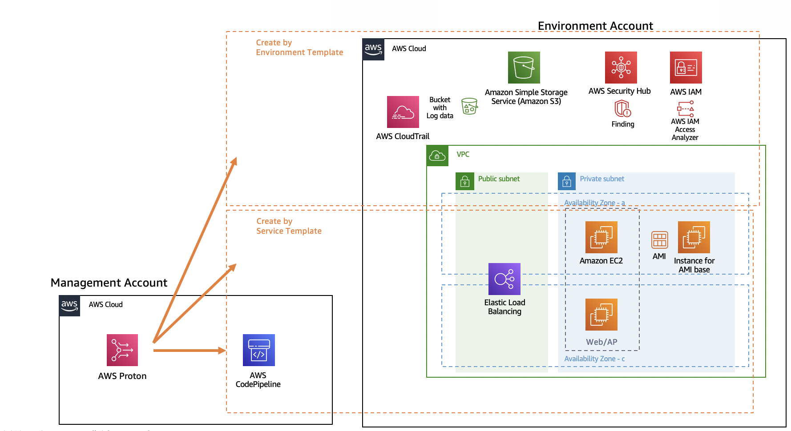

# EC2 based sample template for AWS Proton

This repository is EC2 based template samples for AWS Proton. It created based on [AWS Proton sample templates](https://github.com/aws-samples/aws-proton-sample-templates).

## What kind of infrastructure will this template create?



## How to use this?

- Prepare two AWS accounts for using AWS Proton with following process

  - https://docs.aws.amazon.com/proton/latest/adminguide/ag-setting-up.html
  - During connecting to source code repository, you can fork from [simpleapp-springboot-java repository](https://github.com/yaggytter/simpleapp-springboot-java) to use as a simple Java application.

- Create environment to use environment template

```
### Set up AWS CLI environment as Management account administrator before doing following commands

# Prepare
$ cd ec2-autoscaling
$ AWS_ACCOUNT_ID=`aws sts get-caller-identity|jq -r ".Account"`
$ AWS_REGION='REPLACE_TO_TARGET_REGION'
# As for now, AWS_REGION is should be "ap-northeast-1" because AMI ID in template is specified with Tokyo-region.

# Create environment template
$ aws proton create-environment-template \
  --region ${AWS_REGION} \
  --name "public-vpc-with-security" \
  --display-name "PublicVPCwithSecurity" \
  --description "VPC with Public Access and Security"

# Upload template
$ tar -zcvf env-template.tar.gz environment/
$ aws s3 cp env-template.tar.gz s3://proton-cli-templates-${AWS_ACCOUNT_ID}/env-template.tar.gz \
--region ${AWS_REGION}
$ rm env-template.tar.gz

# Create template as a new version
$ aws proton create-environment-template-version \
  --region ap-northeast-1 \
  --template-name "public-vpc-with-security" \
  --description "Version 1" \
  --source s3="{bucket=proton-cli-templates-${AWS_ACCOUNT_ID},key=env-template.tar.gz}"

# Publish the new version template
$ aws proton update-environment-template-version \
  --region ap-northeast-1 \
  --template-name "public-vpc-with-security" \
  --major-version "1" \
  --minor-version "0" \
  --status "PUBLISHED"

# After published the template, you can create the environment to environment account using AWS Proton console or CLI on management account
https://ap-northeast-1.console.aws.amazon.com/proton/home#/environments

```

- Connect from environment account to management account using folowing page
  - https://ap-northeast-1.console.aws.amazon.com/proton/home#/settings/environment-account-connections
- Create service to use service template

```
# Prepare

# Create service template
$ aws proton create-service-template \
  --region ${AWS_REGION} \
  --name "ec2-autoscaling" \
  --display-name "EC2AutoScalingService" \
  --description "EC2 with an Application Load Balancer"

# Upload template
$ tar -zcvf svc-template.tar.gz service/
$ aws s3 cp svc-template.tar.gz s3://proton-cli-templates-${AWS_ACCOUNT_ID}/svc-template.tar.gz --region ${AWS_REGION}
$ rm svc-template.tar.gz

# Create template as a new version
$ aws proton create-service-template-version \
  --region ${AWS_REGION} \
  --template-name "ec2-autoscaling" \
  --source s3="{bucket=proton-cli-templates-${AWS_ACCOUNT_ID},key=svc-template.tar.gz}" \
  --compatible-environment-templates '[{"templateName":"public-vpc-with-security","majorVersion":"1"}]' \
  --description "Version 1"

# Publish the new version template
$ aws proton update-service-template-version \
  --region ${AWS_REGION} \
  --template-name "ec2-autoscaling" \
  --major-version "1" \
  --minor-version "0" \
  --status "PUBLISHED"

# After published the template, you can create the service to environment account and create the pipeline to management account using AWS Proton console or CLI on management account
https://ap-northeast-1.console.aws.amazon.com/proton/home#/services

```

## How to debug templates for Proton?

The templates for Proton are using jinja2 to replace placeholders in the template. So the template is not worked as a CloudFormation template before replacing placeholders.

You can use 'jinja2cfn.py' script to replace placeholders to debug it.

- Edit 'debug/envdata.py' adjusting with your template.
- Execute following command to emulate replacement process.

```
$ pip install Jinja2
$ python ../debug/jinja2cfn.py ./service/instance_infrastructure/cloudformation.yaml > ./tmp.yaml
```

- You can debug tmp.yaml using regular method for CloudFormation.

## TODO

- Grant least privilege access for IAM roles
